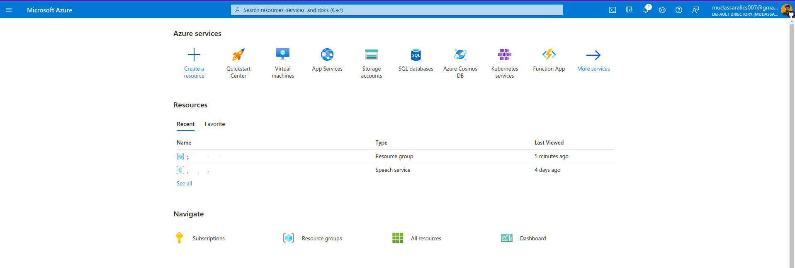
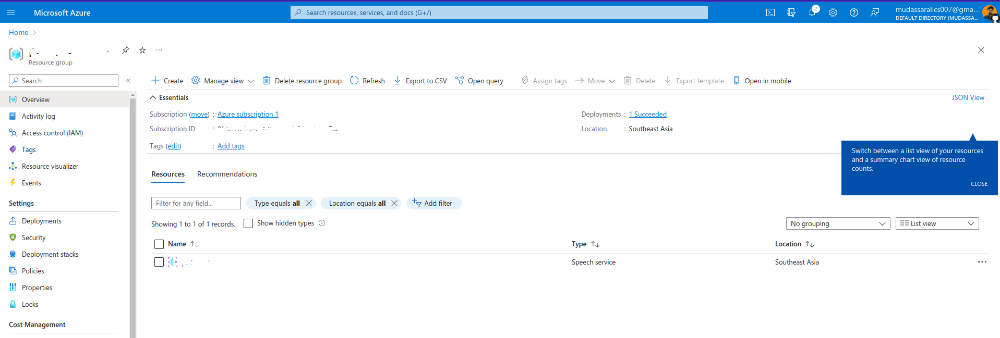
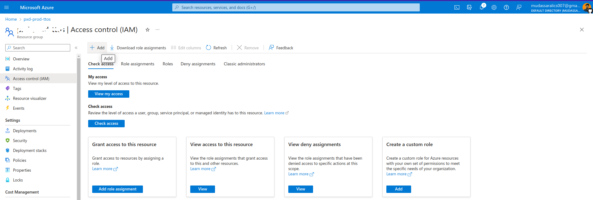
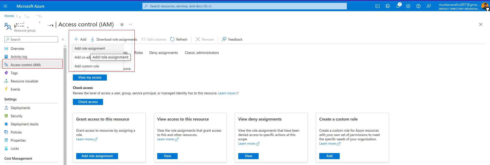
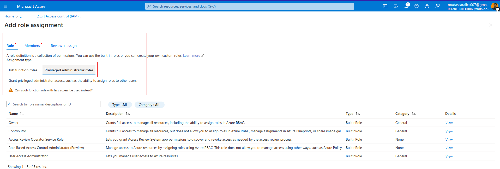
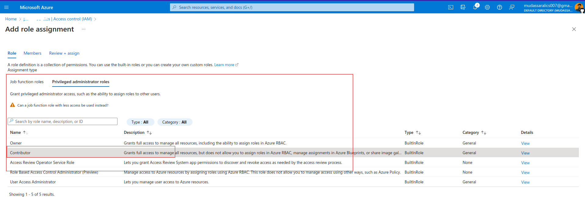
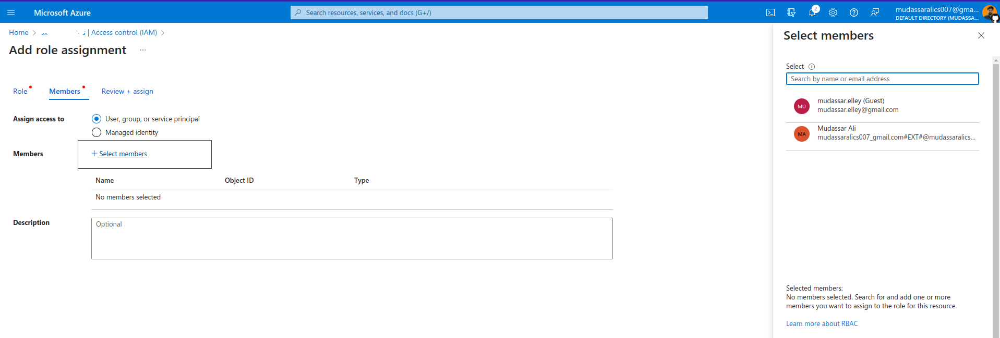
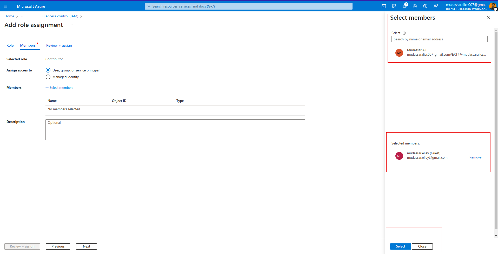
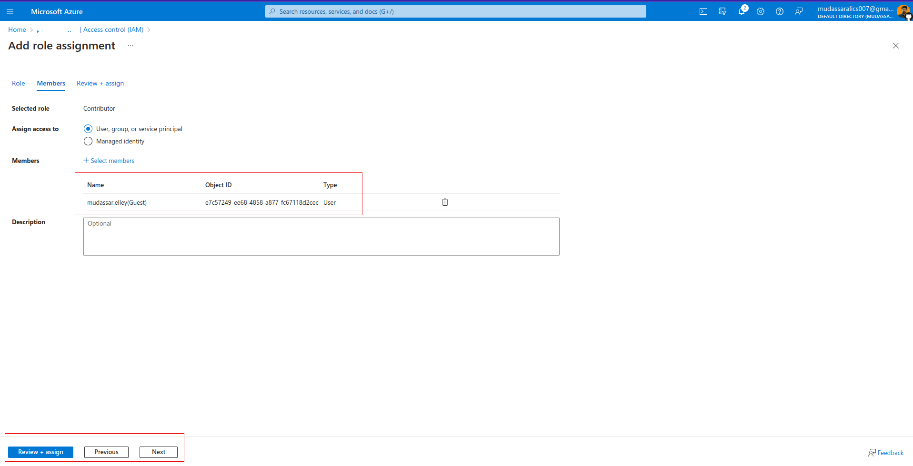

## Azure Cloud - Access Controll(IAM)

To add a user as contributor to directory's(Azure Active Directory) resource group, follow following steps (assuming you're logged in and have directory selected):

1. View Resources on Home Page (https://portal.azure.com/#home)

2. Select any of Resource you're going to give access to

3. Select **Access Control**(IAM)

4. Click on Add (Access Controll --> Add)

5. On **Role** Tab, click on *privillaged Administrator Roles* sub-tab

6. On Privilaged Adminstrator Roles, select your desire role e.g. *Contributor*

7. Once done with selecting appropriate role, next step is to select member. We need to add members from existing added members or a new one by entering users's
email

8. Make sure member is selected as

9. Once done with selecting appropriate role and member, click on **Review + Assign**

That's all. We've successfully invited a member to a resource group to manage resources and all services running under that resource group.